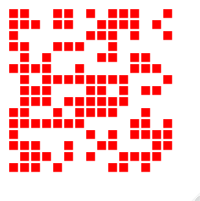

```{r setup, include=FALSE}
knitr::opts_chunk$set(echo = TRUE)
library(r2d3)
# webshot::install_phantomjs()
```


```{r}
library(r2d3)
# webshot doesn't work somehow
```

# Examples From r2d3-snippets

## D3MatrixPlot

Create a plot from a matrix with only 0s and 1s. Can be used to create something like Conway's Game of Life. Graphs attributes can be provided in options. All available ones can be seen in `D3MatrixPlot.js`.

```{r}
set.seed(1234)
my_matrix <- matrix(sample(c(0,1),size = 150,replace = TRUE),nrow = 10,ncol = 15)

height <- 300
width <- 300               
D3MatrixPlot <- r2d3(data = my_matrix,
     script = "r2d3-snippets/D3MatrixPlot.js",
     options = list(
         params = list(
            "rect.fill" = "red",
            "rect.margin" = "20%",
            "svg.fix" = "height",
            "svg.aspectRatio" = 1.5
         )
    ),
     width = width,
     height = height)

# D3MatrixPlot
```


