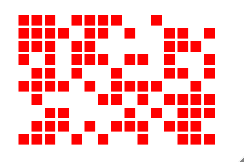

```{r setup, include=FALSE}
knitr::opts_chunk$set(echo = TRUE)
library(r2d3)
```


```{r}
library(r2d3)
```

# Examples of r2d3-snippets

**You can view all following examples on this shiny app:**

https://yifyan-yusuzech.shinyapps.io/yusuzech-r2d3-app/


## D3MatrixPlot

Create a plot from a matrix with only 0s and 1s. Can be used to create something like Conway's Game of Life. Graphs attributes can be provided in options. All available ones can be seen in `D3MatrixPlot.js`.

Available Parameters are:

SVG Margins, Width, Height and Background Color:

> "margin.top","margin.bottom", "margin.left","margin.right", "svg.fix", "svg.aspectRatio", "svg.background"


Rectangle Fill and Margin:

>"rect.fill", "rect.margin"




